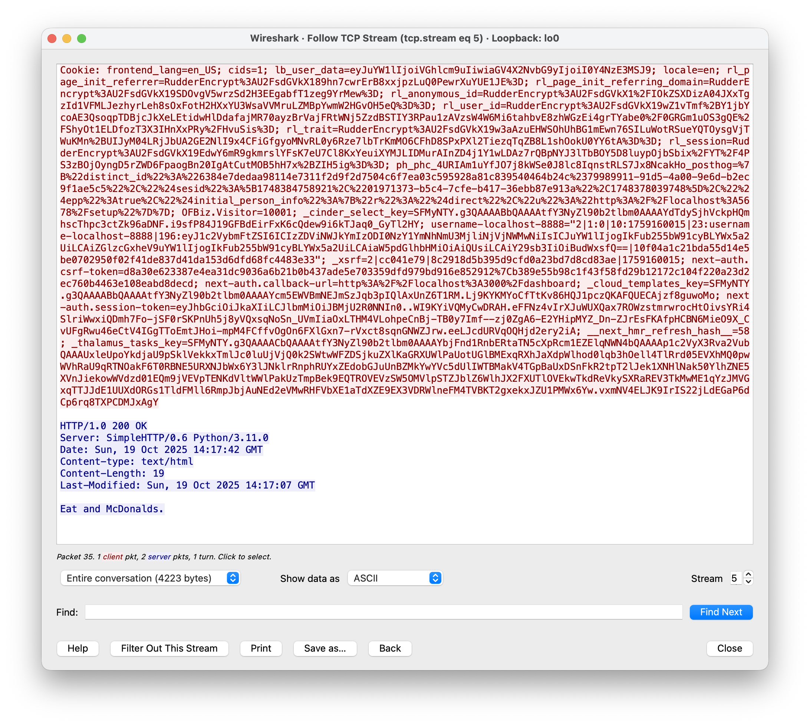
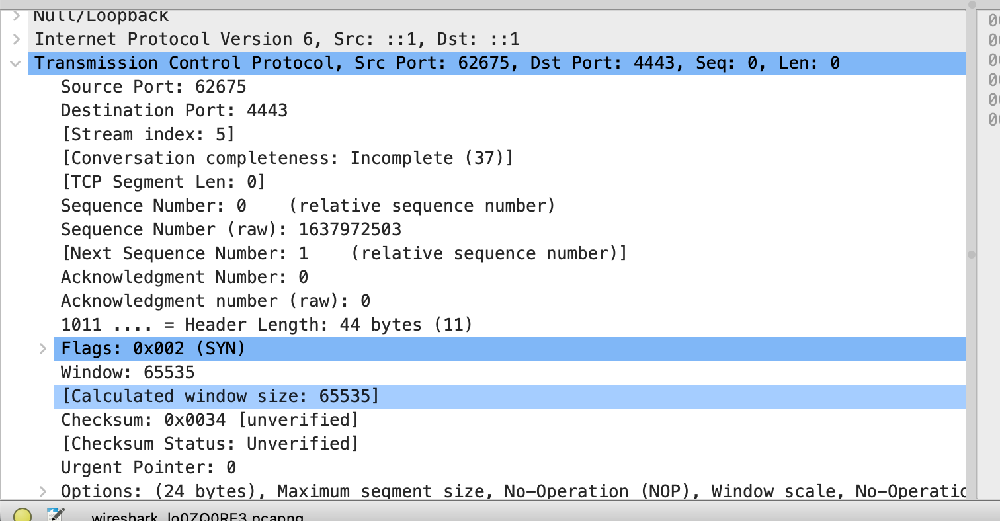

I used Perplexity for this assignment.

# 1. Running a web serve

For this task I ran a simple python webserver.

```bash
python3 -m http.server
```



# 2. Why is HTTP not secure?

HTTP is not secure because the entire conversation is in plain text.

# 3. Self-signed cert

```bash
openssl req -x509 -newkey rsa:4096 -keyout key.pem -out cert.pem -days 365 -nodes
```

We have the server defined here:

```python
import http.server, ssl

server_address = ('localhost', 4443)  # Change port as needed
handler = http.server.SimpleHTTPRequestHandler

httpd = http.server.HTTPServer(server_address, handler)
httpd.socket = ssl.wrap_socket(httpd.socket, certfile='cert.pem', keyfile='key.pem', server_side=True)
print("Serving on https://localhost:4443...")
httpd.serve_forever()
```

And we run it like such:

```bash
python3 https_server.py
```

Now we cannot follow the encrypted conversation:


